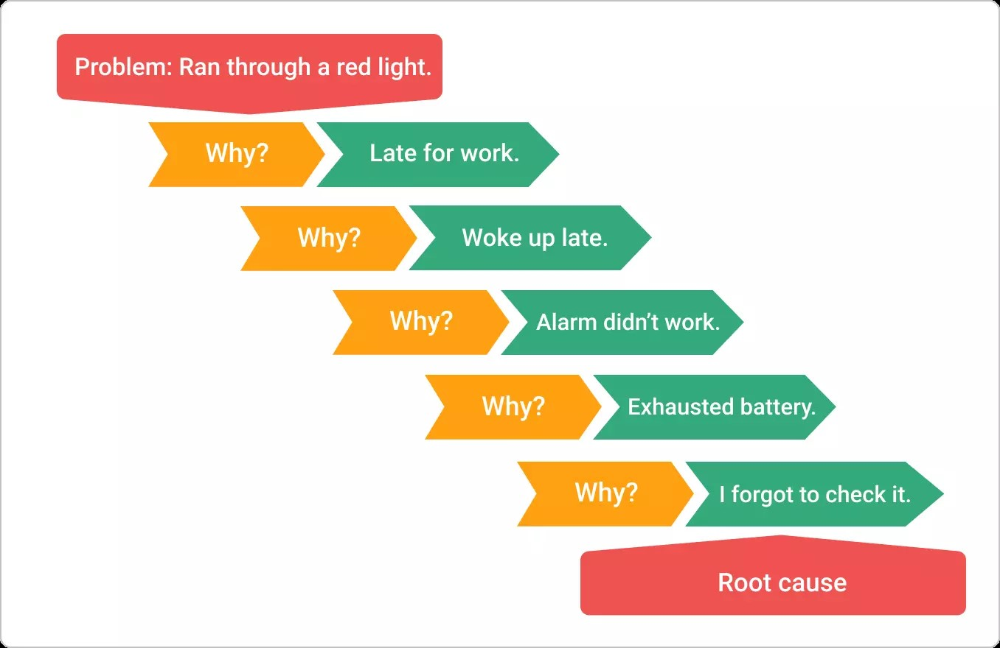
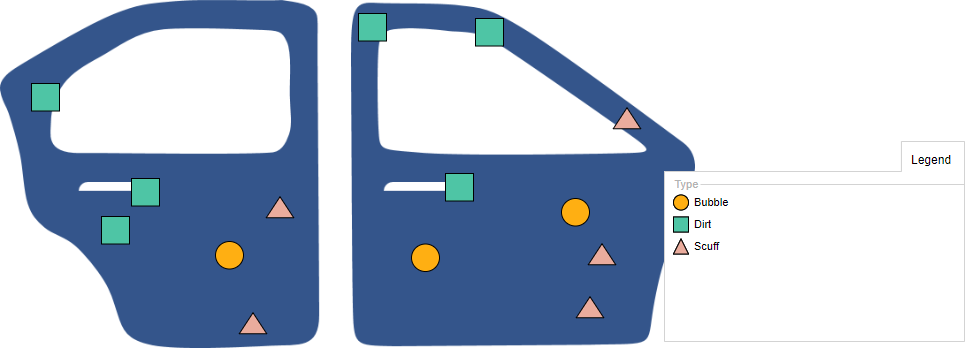

```{r setup, include=FALSE}
knitr::opts_chunk$set(echo = FALSE)
```

## Table of Contents

1. What is quality?
2. The DMAIC Process
3. The "Magnificent 7"
4. Control Chart Basics
5. Introduction to Shewhart-style Charts

## What is Quality?

- Quality is a word we hear all the time, but what does it mean to you? 

\vskip 0.25 in

- In terms of a product? In terms of a service? In terms of software/user interfaces?

## What is Quality?

- We can define quality in a few different ways. First, we can examine quality in terms of its dimensions:

1. Performance (Will the product/service do what it's supposed to do?)
2. Reliability (Does the product/service consistently do what it's supposed to do?)
3. Durability (How long does the product/service last?)
4. Serviceability (Is it easy to fix (if it's a product) or have your problems solved (if it's a service)?)
5. Aesthetics (What is the visual appeal of the product/service?)

## What is Quality?

6. Features (What does the product/service do?)
7. Perceived Quality (What is the reputation of the product/company?)
8. Conformance to Standards (Is the product made exactly how the designer intended?)

## What is Quality?

- For services specifically, there are three additional dimensions:

1. Responsiveness (How quickly does the company address your concerns?)
2. Professionalism (Does the company have the knowledge and skills to perform the service? Additionally, do they treat you with care and have professional appearance both physically and in communication?)
3. Attentiveness (Are my needs being personally met and do I feel like I'm being "taken care of?")

## What is Quality?

- As we go through all of these dimensions of quality, we can see that quality centers around this idea of "fitness of use."

\vskip 0.25 in

- When we think about quality in this way, we can see that in order for an organization to have a quality product or service, that we have to have quality in both the design stage (engineering designs, app mock-up, service plan etc.) as well as in the on-line stage (manufacturing, app goes live, store opens up etc.)

\vskip 0.25 in

- Obviously these two things go hand in hand

## What is Quality?

- If we have well-designed a product or process, then in the on-line phase when we're manufacturing the product or running our service business, we would say that we have a quality product or service when it varies little from the initial design.

\vskip 0.25 in

- In other, more statistical language, quality is the inverse of variability and thus, \textbf{quality monitoring and improvement} is the systematic monitoring of and reduction of variability in a process.

## What is Quality?

- Why should a business/organization care about quality?

\vskip 0.25 in

- Well, lots of reasons, but primary of which is money. If we are manufacturing a car and something is found to be defective after the car is being driven by consumers, we have to pay lots of money to fix that problem that potentially could have been avoided.

\vskip 0.25 in

- In a service-type of business, like home internet, if our service is unreliable or if our customer service is poor, then people will avoid us. 

## What is Quality?

- Quality is especially important in our hyperconnected world because if I'm unhappy with a product or service, I can post an angry message on social media saying how unhappy I am and hundreds or thousands of people might see it and potentially avoid whatever it is that I was mad about. Conversely, think about how popular the Stanley Mug became last year because of social media.

## The DMAIC Process

- When we're at the beginning of monitoring a process, something critical that ought to be done is having a well thought out plan of what is to be monitored, why, how and how often, and what steps will be taken when something needs to be changed.

\vskip 0.25 in

- This set of procedures is generally referred to as the DMAIC process where "DMAIC" is an acronym for: "Define, Measure, Analyze, Improve and Control." 

\vskip 0.25 in

- Each of these different words represents a different part of the quality control and improvement process/program and thus has a slightly different set of tools used at each point.

## The DMAIC Process: The Define Phase

- Obviously when we're monitoring some process, we have to have an idea of what it is that we're monitoring and why we're doing it. A big component of this phase is to clearly define what is to be monitored as well as all relevant processes that support the primary monitored process.

\vskip 0.25 in

- So for example, let's say we are opening a coffee shop. One thing we want to ensure is that the coffee is of high quality and that the customers are satisfied with it. 

\vskip 0.25 in

- Let's draw out a flow chart to map out everything that goes into producing a high quality cup of coffee.

## The DMAIC Process: The Define Phase

- While we're mostly going to focus on the statistical side of the quality control, it is important to remember that processes take place inside of and around organizations.

\vskip 0.25 in

- If there is not buy-in from everyone in the organization with respect to the quality program being implemented, it will likely fail.

\vskip 0.25 in

- Thus, a big component of the define phase is to clearly articulate the reason why this program is going to help improve quality and have the support of workers at all levels of the organization. 

## The DMAIC Process: The Measure Phase

- After we have defined the process to monitored, we now have to decide what is to be measured and how it is to be measured.

\vskip 0.25 in

- Here, we are introduced to the idea of \textbf{quality characteristics} of a process. A quality characteristic is, well, a characteristic of a process that we have operationalized to be an indicator of quality. These QCs can be something quantitative (a variable) or some attribute that is non-quantitative.

\vskip 0.25 in

- On our flow chart, let's write out what will be measured (and how) at each of the nodes.

## The DMAIC Process: The Measure Phase

- Clearly, the measure phase is important because if we only have some vague idea of what quality operationally means to us, then the whole program will fail. 

\vskip 0.25 in

- We can think of these first two steps as the first two steps in any research situation: What is my research question? What variable(s) are indicators of process quality? What relevant data will I collect to address that research question and assess quality?

## The DMAIC Process: The Analyze Phase

- Now that we have defined our process and decided what will be measured, we can begin analysis.

\vskip 0.25 in

- We have all sorts of tools at our disposal to analyze data, some simpler than others. Choosing which tools to use (like a histogram, regression analysis, factorial ANOVA etc.) largely depend on the nature of the process.

\vskip 0.25 in

- However, the goal of the analysis phase is to generally identify potential sources of variability as efficiently as possible.

\vskip 0.25 in

- Your text describes two causes of variability: that which arises from a common cause (a flaw in the process overall) and that which arises from an assignable cause (a flaw in a specific part of the process).

## The DMAIC Process: The Analyze Phase

- Let's say that to monitor customer satisfaction with the taste of our coffee, we send them a quick yes/no survey asking how if they were satisfied with the taste via an email. 

\vskip 0.25 in

- We get responses daily and aggregate them in a database that records the time the completed survey was received as well as the customer response. 

\vskip 0.25 in

- Let's think: what statistical tool(s) could we use to analyze these data?

## The DMAIC Process: The Improve Phase

- If in our analysis we have determined that our process is not performing the way we'd like, we now have to do our best to improve it. 

\vskip 0.25 in

- Part of this, especially in non-manufacturing settings, requires creative thinking. But even in manufacturing settings, if a product is not being made to specification, there could be a variety of reasons why that is. 

\vskip 0.25 in

- For example, let's say that we noticed in the last month that the proportion of people saying that they're dissatisfied with the taste of the coffee has gone up. Here's where a simple albeit powerful tool, \textit{the five why's}, can be implemented.

## The DMAIC Process: The Improve Phase

- The five why's are exactly what they sound like. We start with the first why: "Why is the proportion of our customers dissatisfied with our coffee's taste going up?" We may need to have a focus group of some kind where unbiased people give it a try and let us know their opinions. 

\vskip 0.25 in

- This will invariably lead to a second "Why?" and so on. 

\vskip 0.25 in

- We can also think about the process of brewing and serving coffee as a whole and identify points where poor quality could occur (i.e., new supplier, new brewing machine, new staff who aren't adequately trained etc.) and make changes as appropriate.

## The DMAIC Process: The Improve Phase

```{r,echo=F,include=T,out.width="75%",out.height="75%",fig.align='center'}

```

## The DMAIC Process: The Improve Phase

- One thing to note with the improve phase is that there really isn't a point where you can say, "Okay well we don't have to do this anymore." It's an ongoing, indefinite process. 

\vskip 0.25 in

- Additionally, people's tastes and preferences and what they perceive something of high quality to be changes! So for example, one feature of a car that signified high quality used to be having a cassette player. I highly doubt many people would think a new car with a cassette player would denote a high quality feature nowadays. 

\vskip 0.25 in

- Really, the goal of the improvement phase is to create a process that at the present time works the way we want it to work. In the next phase, we monitor this process to minimize deviations away from what our target is.

## The DMAIC Process: The Control Phase

- Once we have improved our process to the point where it functions the way we want it to function, we now want to control the process.

\vskip 0.25 in

- This is where control charts come into play. Once we know how a process ought to work when it is working the way we want it to (i.e., is "in control"), we can use a control chart to help us graphically and statistically determine when the process is "out of control" or not performing the way we have determined it should. 

## The DMAIC Process: The Control Phase

- We'll touch on the elements of a control chart here shortly, but as you can see, each step in the DMAIC process is critical to getting to the point where a control chart can be used. Otherwise, if we skip steps, we may end up having the wrong answer to the right question or vice versa.  

## The Magnificient 7

- While the focus of this class will largely be on control charts, there are other graphical methods for analyzing and improving processes. Some you are likely already familiar with, but the ones primarily used in process improvement are referred to as the "Magnificent 7" and include:

## The Magnificent 7

- A Histogram

```{r,include=TRUE,echo=FALSE,message=FALSE,warning=FALSE}
set.seed(12345)
cs <- abs(rnorm(30,mean=4,sd=0.5))
cs <- ifelse(cs > 5,5,cs)
library(ggplot2)
ggplot() + geom_histogram(aes(cs),bins=8) + labs(x = "Customer Satisfaction", y = "Frequency") +
  theme_classic() + ggtitle("Histogram of Mean Customer Satisfaction Scores",
                            subtitle="Past 30 Days") +
  theme(plot.title=element_text(hjust=0.5),plot.subtitle=element_text(hjust=0.5))
```

## The Magnificent 7

- A Check Sheet

```{r, echo=FALSE, out.width="60%",out.height="60%",fig.cap="Figure 5.16 from Text"}
knitr::include_graphics("CheckSheet.jpg")
```

## The Magnificent 7

- A Pareto Chart

```{r,include=TRUE,echo=FALSE,message=FALSE,warning=FALSE}

library(tidyverse)

css <- as_tibble(c(
  
  rep("Didn't Like Flavor",35),
  rep("Didn't Have Creamer I Like",25),
  rep("Not Hot Enough",15),
  rep("Too Expensive",10),
  rep("Disposable Cup Spills Easily",10),
  rep("Other",5)
  
))

freqz <- css %>%
  dplyr::count(value)

freqz <- freqz[order(freqz$n,decreasing=TRUE),]

freqz$value <- factor(freqz$value,levels=freqz$value)

freqz$cumulative <- cumsum(freqz$n)

ggplot(freqz,aes(x=value)) + geom_bar(aes(y=n),fill="blue",stat="identity") + 
  labs(x="Reasons for Poor Customer Review",y="Frequency") + theme_classic() + 
  ggtitle("Pareto Chart for Reasons for Poor Customer Reviews") +
  theme(plot.title=element_text(hjust=0.5))
```

## The Magnificent 7

- A Cause-and-Effect Sheet

```{r, echo=FALSE, out.width="75%",out.height="75%",fig.cap="Figure 5.19 from Text"}
knitr::include_graphics("CauseandEffect.jpg")
```

## The Magnificent 7

- A Defect Concentration Diagram

```{r, echo=FALSE, out.width="75%",out.height="75%",fig.cap="From https://online.visual-paradigm.com"}

```

## The Magnificent 7

- A Scatterplot

```{r,echo=FALSE,warning=FALSE,message=FALSE}
df <- abs(MASS::mvrnorm(100,c(5,4),matrix(c(9,-2.25,-2.25,1),ncol=2)))
df <- as.data.frame(df)
names(df) <- c("Time in Drive-Thru","Customer Review")
df$`Customer Review` <- ifelse(df$`Customer Review` > 5,5,df$`Customer Review`)
ggplot(df,aes(x=`Time in Drive-Thru`,y=`Customer Review`)) + geom_point() + theme_classic() +
         ggtitle("Scatterplot of Mean Time Spent in Drive-Thru vs Mean Review",
                 subtitle="Last 100 Days") +
         theme(plot.title=element_text(hjust=0.5),plot.subtitle=element_text(hjust=0.5))
```

## The Magnificent 7

- A Control Chart

```{r,echo=FALSE,warning=FALSE,message=FALSE}
xbar <- rnorm(10)
ggplot() + geom_point(aes(x=seq(1,10,by=1),y=xbar),color='black') +
           geom_line(aes(x=seq(1,10,by=1),y=xbar),color='black') +
  geom_point(aes(x=seq(1,10,by=1),y=3),color='red') +
           geom_line(aes(x=seq(1,10,by=1),y=3),color='red') +
  geom_point(aes(x=seq(1,10,by=1),y=-3),color='red') +
           geom_line(aes(x=seq(1,10,by=1),y=-3),color='red') +
  geom_line(aes(x=seq(1,10,by=1),y=0),color='green') +
  labs(x="Time Point",y="Value") + theme_classic() + 
  ggtitle("Example of a Shewhart X-bar Chart") + theme(plot.title=element_text(hjust=0.5)) +
  scale_x_continuous(n.breaks=10)
```

## Elements of a Control Chart

- In general, all control charts have the same components:
\vskip 0.10 in
    - A plotting statistic, which is a summary statistic taken from a sample of the monitored process at a particular point in time.
    \vskip 0.05 in
    - A Target Value, which is either known or estimated from historical data and is the ideal value of whatever it is that we're monitoring.
    \vskip 0.05 in
    - Control Limit(s). These are analogous to critical values from traditional hypothesis testing (i.e., if a plotting statistic exceeds a control limit, this implies the process is no longer operating in an in-control state). 
    \vskip 0.10 in
- If we examine the prior slide which is a simple example of what's referred to as the "Shewhart $\bar{X}$-Chart," we can see that we have all three elements. 

## Elements of a Control Chart

- Most of the time, a control chart is used as the last part of the DMAIC process, after it has been already established that the monitored process is in a state of control and exhibits \textit{capability}.

\vskip 0.10 in

- When a control chart is being used in this second phase, we're assuming that any deviation from target (when a plotting statistic exceeds a control limit) is a result of some new cause.

\vskip 0.10 in

- There are two types of causes: (1) random cause and (2) non-random cause.
    - A random cause is like a Type I error; the control chart signaled out-of-control due to random chance, and not because the process is truly out-of-control.
        - We want to minimize this as much as possible!
    - A non-random cause or assignable cause is when something has truly happened that is correctable.
        - We want to find this out as quickly as possible!
        
## Elements of a Control Chart

- Thus, any control chart worth its merit should be designed such that:

\vskip 0.25 in

    1. We aren't getting false alarms too often.
    
\vskip 0.25 in

    2. If our process has really deviated away from target, that we can find that out as quickly as possible.
    
\vskip 0.25 in

- In this course, we will discuss several control charts designed for particular processes and talk about when each would be most appropriately used.

